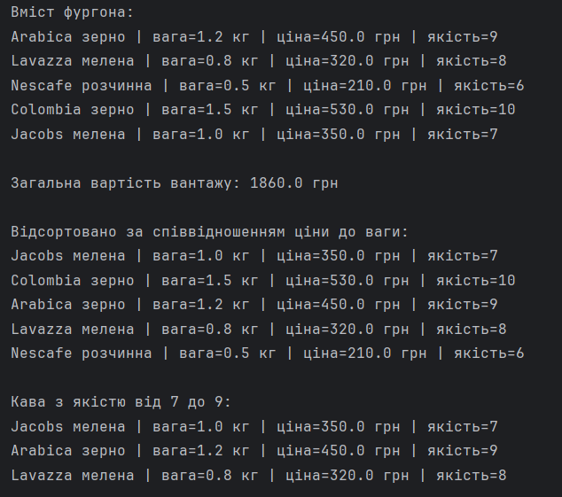

# Лабораторна робота №5 – Наслідування та поліморфізм

## Варіант: 11 — Ієрархія кави

### Опис

Для лабораторної роботи реалізовано ієрархію класів:

Coffee (абстрактний клас)

→ BeanCoffee  
→ GroundCoffee  
→ InstantCoffee

Створено клас Van, який містить масив об'єктів кави та дозволяє виконувати операції:

- підрахунок загальної вартості вантажу;
- сортування товарів за співвідношенням ціни до ваги;
- пошук кави у фургоні по діапазону якості.
## Результат
